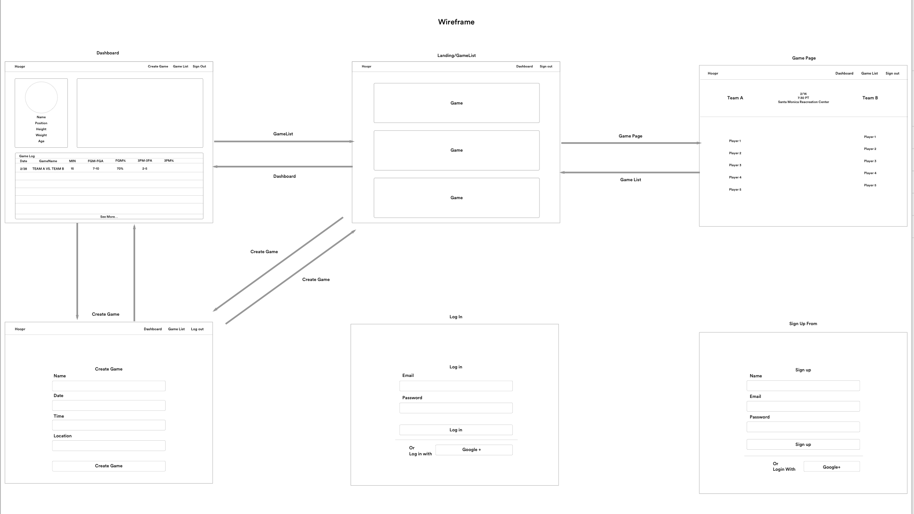
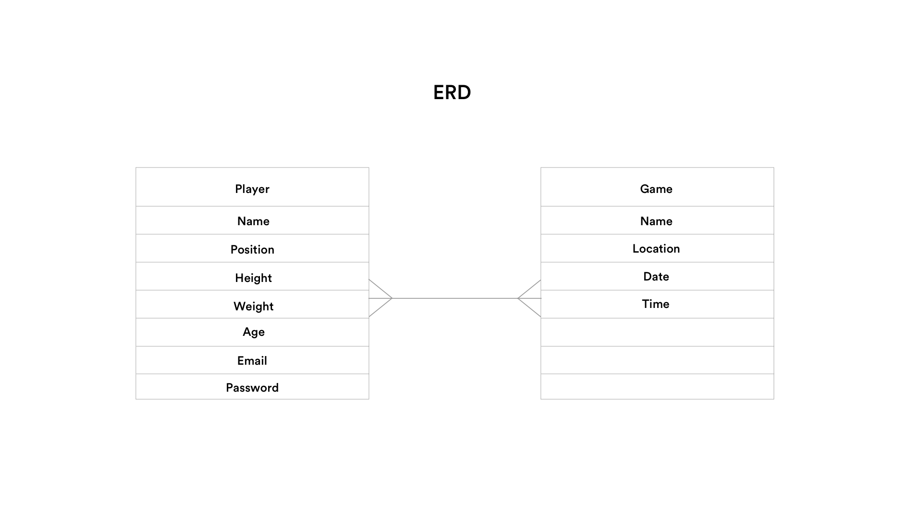

# Hoopr

--
### Brief Description

Hoopr lets you create your own basketball player profile and search for tournaments and games to join.

**MVP:**
Basic CRUD app for Hoopr with React as the front-end framework.

**Dream Feature:**
User will be able to form teams with other user and join tournaments and games.

--
###Explanation of Technologies Used

**Backend:**

* Node.js
* **Packages:** Express, Mongoose, Bcrypt, body-parser, connect-flash, MongoDB, dotenv, morgan, react-router-dom, axios, jwt-decode

**Front-End:** 

* React.js
* JavaScript
* HTML
* jQuery
* Bootstrap

--

### Planning Docs

**Screenshot of Wireframe**

**Screenshot of ERD**

--

--

###Approach Taken

**1. Planning Phase**

After understanding the project requirements I immediately started to create my ERD and Wireframe to get a better understanding of the scope of my app.

Our **Trello board** helped immensely with this: 

[https://trello.com/b/H47azMkh]()

**2. We executed the simple stuff first**

In the first day, we were able to complete the basics of our app including login, a user model and a sketch model. We also had a working canvas for drawing.

**3. Communication and Daily Stand-ups**

After we completed the foundation, the rest of the project was a bit more complex. We broke up the pieces into smaller parts and worked together to figure out complex bugs. 

**4. Polish**

Once we had most of our MVP complete, we did a lot of testing to find bugs and correct them and finalize issues.  

--

###Major Hurdles & Victories
* Staying on top of merge conflicts
* Fixing the edit and update bugs

--
### If we had more time:
* Make code more DRY and clean
* Add canvas edit 
* Add web sockets for playing pictionary
* Reveal the giphy photo after
* Add more dream features (see Trello ICE board)
__

### Installation Instructions

For easy-start, go to this heroku app:
[http://sketchyapp.herokuapp.com/](Sketchy)

To run this app, locally, you will need to register for your own API keys and do these following steps: 

1. Fork it over to your git hub. 

2. Do a git clone in your terminal from your github. 

3. Add a .env file to your root of your application. 
 

4.  Get an APIKEY from [Giphy](https://developers.giphy.com/)
5. Get a Client ID and Client secret from [Google Developers API](https://console.developers.google.com/apis/) 

6. API keys should have no space in them. Use these 

* APIKEY=**************
* CLIENTID=*************
* CLIENTSECRET=*********
* GOOGLECALLBACK=http://localhost:3000/auth/google/redirect

7. Run npm install to install all packages
8. Open up a new tab and run $mongod
(If you don't already have Mongo, you will need to do a brew install)
9. Open up another new tab and run $nodemon
(If you don't already have Nodemon, you will need to do a brew install)
10. Save your code and enjoy Sketchy!

--

